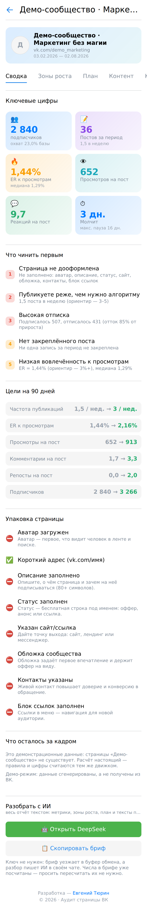
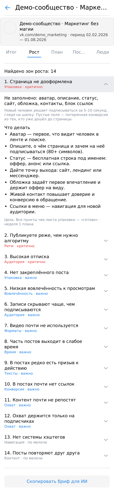
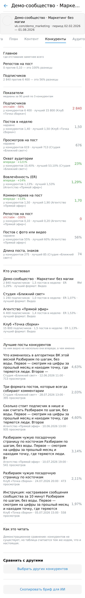

# vk-audit · мини-приложение ВКонтакте

Аудит страницы ВК прямо внутри ВКонтакте: метрики, зоны роста и план на
4 недели. Порт десктопной программы vk-audit (ветка `claude/vk-audit-android-apk`
в репозитории `presentation`) на VK Mini Apps.

<p>
  
  
  
</p>

## Главное

**Сервер не нужен.** Данные берутся пользовательским ключом через
`VKWebAppCallAPIMethod`, расчёт идёт в браузере, наружу не уходит ничего.
Одна страница — 5–8 запросов к API при лимите 3 запроса в секунду.

**Цифры те же, что в exe и APK.** Движок перенесён один в один, а тесты
в `src/engine/` сверяют TS-версию с эталоном питоновской: 24 проверки на общих
демо-данных — метрики до пятого знака, порядок зон роста, формулировки с числами
слово в слово, карточки и вердикты в сравнении с конкурентами.

## Что внутри

| Путь | Что это |
|---|---|
| `src/engine/` | движок: метрики, 30+ правил зон роста, план, цели. Чистый TS без React и VK Bridge — переносится на сервер как есть |
| `src/vk/` | мост к ВК: клиент API с троттлингом, вход, сбор данных, демо-режим |
| `src/components/`, `src/panels/` | интерфейс на VKUI |
| `src/report/brief.ts` | бриф для чата с ИИ: весь контекст текстом, без ключей и без сети |

Отчёт разложен на шесть вкладок: сводка с KPI и целями, зоны роста с разбором
каждой находки, план на 4 недели с галочками, контент (форматы, тепловая карта
времени, топ и антитоп постов), конкуренты и аудитория (охваты,
подписки-отписки, демография — если вошли под администратором).

## Сравнение с конкурентами

Вкладка «Конкуренты»: до пяти ссылок на похожие сообщества → таблица
показателей. Считаются **медианы за 90 дней**, а не средние: один залетевший
пост не должен превращать слабую страницу в сильную. Рядом с каждым
показателем — медиана по конкурентам, лучший результат с именем лидера
и вердикт «впереди / наравне / отстаём» (расхождение до 10% считается
равенством).

Клиент пересобирается за те же 90 дней — сравнивать полугодовые медианы
с трёхмесячными нельзя. Закрытая или удалённая страница не роняет прогон:
она попадает в список пропущенных, остальные считаются. Отдельным блоком идут
лучшие посты конкурентов с текстами — по ним видно не насколько они впереди,
а чем именно.

## Запуск

```bash
npm install
npm run dev      # http://localhost:8910
npm test         # сверка движка с десктопной версией
npm run build
```

Демо-отчёт открывается кнопкой на первом экране — без входа и без ключей,
на вымышленном сообществе. Удобно проверять вёрстку и показывать, что умеет
программа.

## Настройка приложения ВКонтакте

1. На [dev.vk.ru](https://dev.vk.ru/) создайте мини-приложение и возьмите его
   числовой **ID**. Это не секрет — он виден в адресной строке при любом входе.
2. Положите ID в `.env`:

   ```
   VITE_VK_APP_ID=12345678
   ```

3. В настройках приложения → **Доверенный redirect URI** добавьте:

   ```
   http://localhost:8910/callback
   ```

Третий шаг нужен не мини-аппу, а десктопной и мобильной версиям: они ловят ключ
доступа на локальном порту 8910. Адрес зашит в `src/oauth.ts` — единственном
месте, откуда его берут и приложение, и dev-сервер Vite. Тот же адрес
использует `vk_audit/auth.py` в exe и сборка под Android, поэтому все три
клиента живут на одном приложении ВК. Менять порт можно только одновременно
в `src/oauth.ts`, в настройках на dev.vk.ru и в десктопной версии — иначе ВК
ответит `redirect_uri is incorrect`.

Внутри ВКонтакте вход идёт через `VKWebAppGetAuthToken`, и redirect не
используется вовсе. Запасной путь через `oauth.vk.com` включается сам, когда
приложение открыто вне ВК — например, если его открыла десктопная программа
в браузере.

## Права доступа

Запрашиваются `groups` и `stats`:

| Что в отчёте | без прав админа | под админом сообщества |
|---|:---:|:---:|
| посты, просмотры, реакции, ER, ритм, форматы, время | да | да |
| зоны роста, план, цели | да | да |
| охваты, демография, подписки-отписки | нет | да |

Любое **открытое** сообщество аудируется целиком по публичным данным — своё
или чужое. Внутреннюю статистику ВК отдаёт только администратору; это
ограничение платформы, а не программы.

## Чего здесь пока нет

Прогона по нише пакетом и ИИ-разбора. Первый упирается в лимит 3 запроса
в секунду: список из полусотни сообществ собирался бы минут двадцать. Второй
требует сервера — ключ модели нельзя класть в бандл, его достанут командой
`strings`. Вместо ИИ-разбора кнопка **«Скопировать бриф для ИИ»** собирает весь
контекст отчёта текстом (вместе со сравнением, если оно собрано), который
вставляется в любой чат руками.

## Ограничение среды

Запасной HTTP-транспорт (`src/vk/api.ts`, режим `http`) написан, но не проверен
на живом ВК: сетевая политика окружения, где собиралось приложение, не пускает
запросы к `api.vk.com`. Основной путь — через VK Bridge — от него не зависит.

---

Движок и десктопная версия — **Евгений Тюрин**, © 2026
