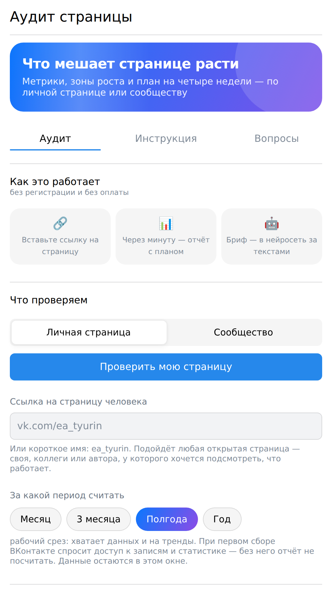
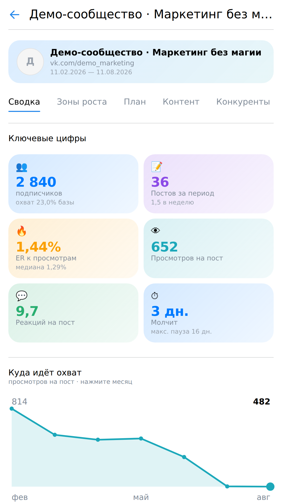
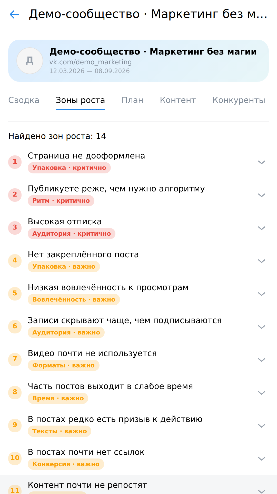
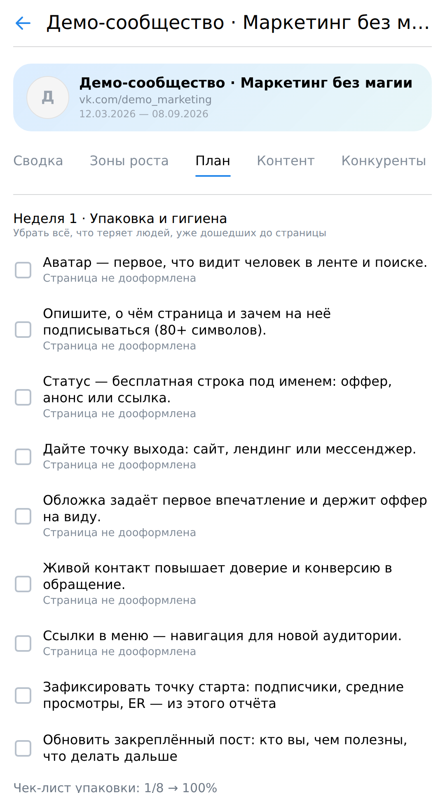
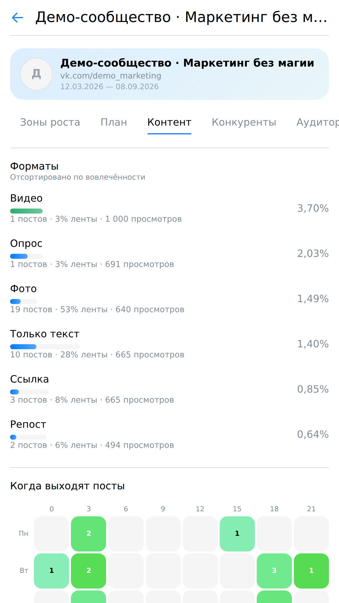
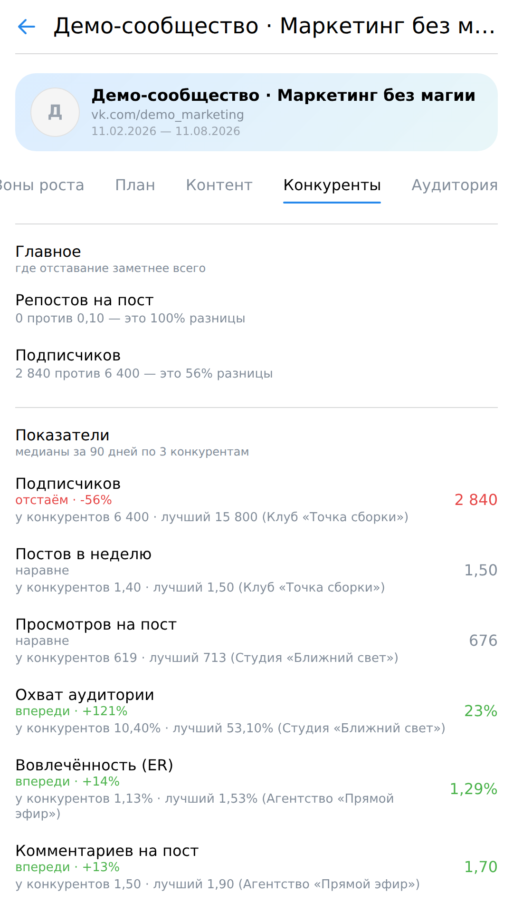

# Как пользоваться · разбор личной страницы

Пошагово, на примере личной страницы — `vk.com/ea_tyurin`. Приложение
одинаково разбирает и сообщества, и профили людей; личная страница чуть
проще, и отличия честно перечислены в конце.

Приложение: **[zhenyagen.github.io/miniapps](https://zhenyagen.github.io/miniapps/)**
Времени на весь разбор — минута-полторы.

> Кадры ниже сняты с демо-режима: там вымышленное сообщество «Маркетинг
> без магии». Экраны для личной страницы те же самые, цифры — ваши.
> Что именно будет выглядеть иначе — в разделе [«Чем личная страница
> отличается»](#чем-личная-страница-отличается-от-сообщества).

---

## Шаг 1 · Вставить ссылку на страницу

В поле подойдёт любой из вариантов:

- `vk.com/ea_tyurin` — как в адресной строке;
- `ea_tyurin` — просто короткое имя;
- `vk.com/id12345` — если короткого адреса нет.

Разбирать можно **не только свою** страницу: любая открытая читается
публично. Так проверяют коллег, конкурентов и авторов, у которых хочется
подсмотреть, что работает.

Кнопка «Собрать аудит» неактивна, пока поле пустое, — это нормально.

**Не хотите вводить ничего** — внизу есть «Открыть демо-отчёт». Он
показывает те же экраны на вымышленных данных, вход не нужен.

## Шаг 2 · Войти через ВКонтакте

Без входа ВК не отдаёт данные вообще — даже публичные. Приложение просит
два права:

| Право | Зачем |
|---|---|
| `groups` | список ваших сообществ, чтобы не вводить ссылку руками |
| `stats` | охваты и демография **ваших** сообществ |

Для разбора личной страницы ни то, ни другое не обязательно — профиль
читается публичными методами. Права запрашиваются один раз, на все случаи.

Данные никуда не уходят: расчёт целиком в окне приложения, сервера
у него нет. Ключ доступа живёт в памяти вкладки и пропадает, когда вы
её закрываете. Подробности — в
[политике конфиденциальности](https://zhenyagen.github.io/miniapps/privacy.html).

Отозвать доступ: Настройки ВКонтакте → «Настройки приложений».

## Шаг 3 · Сводка — шесть цифр и что чинить первым

Берётся **180 дней** назад, до 300 последних постов. Период подписан
под именем страницы.

Как читать плитки:

| Плитка | Что значит | Когда плохо |
|---|---|---|
| **Подписчиков** | сколько людей вас читает, и какая доля видит посты | охват базы ниже 15% |
| **Постов за период** | и частота в неделю | меньше 3 в неделю |
| **ER к просмотрам** | реакции на 100 просмотров — главный показатель качества | ниже 1% |
| **Просмотров на пост** | сколько людей реально дошло до записи | сравнивать с числом подписчиков |
| **Реакций на пост** | лайки, комментарии и репосты вместе | — |
| **Молчит** | сколько дней с последнего поста и самая длинная пауза | пауза больше двух недель |

Ниже — **«Что чинить первым»**: четыре верхние проблемы с номерами.
Цвет номера — серьёзность: красный «критично», жёлтый «важно».

Порядок не случайный: он считается из того, насколько сильно проблема
бьёт по росту и насколько дёшево её починить. Красное первым — потому
что это чаще всего упаковка, а её правят за вечер.

## Шаг 4 · Зоны роста — весь список

Полный список находок, каждая с меткой раздела: упаковка, ритм,
аудитория, вовлечённость, форматы, время, тексты, конверсия.

**Тапните строку — она раскроется.** Внутри три вещи:

1. **Доказательство** — цифра, из-за которой правило сработало.
2. **Почему это мешает** — механика: что именно делает лента ВК.
3. **Что сделать** — два-три конкретных действия, а не «улучшите контент».

Четырнадцать пунктов — обычный результат. Это не приговор: критичных
из них обычно три-четыре, остальное — «важно» и «можно позже».

Читать всё подряд не нужно. Разверните три верхних, остальное оставьте
на потом — план из следующего шага и так расставит их по неделям.

## Шаг 5 · План на 4 недели

Те же находки, но разложенные по неделям и превращённые в задачи
с галочками. Первая неделя всегда «упаковка и гигиена» — то, что теряет
людей, уже дошедших до страницы: пустое «о себе», отсутствующий статус,
адрес вида `vk.com/id123`.

Под каждой задачей серым — из какой находки она выросла. Внизу
недели — **KPI**: по какому числу поймёте, что неделя закрыта
(«Чек-лист упаковки: 1/8 → 100%»).

Галочки живут только в открытой вкладке: приложение ничего не сохраняет.
Если план нужен насовсем — скопируйте бриф (шаг 8) или сделайте скриншот.

## Шаг 6 · Контент — форматы и время

**Форматы** отсортированы по вовлечённости, а не по количеству. Полоска
показывает долю ленты. Типичная картина: сверху видео и опросы с высоким
ER, но их 1–2 поста, а внизу фото — половина ленты. Это и есть подсказка:
формат, который заходит, вы почти не используете.

Осторожно с выводами по одному-двум постам: 3,70% на одном видео —
это ещё не тренд, а совпадение. Смотрите на форматы, где хотя бы
пять записей.

**Тепловая карта** — когда вы публикуете, по дням недели и часам.
Цвет — вовлечённость, число — сколько постов вышло в этот слот.
Ищите зелёные клетки с одним постом: там сработало, а вы туда почти
не пишете.

## Шаг 7 · Конкуренты

Введите до пяти ссылок — и приложение соберёт их так же, как вашу
страницу, и посчитает медианы. Не средние: одна страница-гигант
не должна утаскивать ориентир вверх.

Период здесь короче — **90 дней**, и вашу страницу приложение
пересобирает за тот же срок. Сравнивать полугодовую историю
со свежими тремя месяцами было бы нечестно.

Сверху — **«Главное»**: два-три показателя, где отставание заметнее
всего. Ниже — построчное сравнение: ваша цифра, медиана по конкурентам
и лучший результат с именем страницы.

Для личной страницы «конкуренты» — это коллеги по нише и авторы,
у которых похожая аудитория. Не берите миллионники: сравнение
с несопоставимой страницей даёт красные проценты и ноль пользы.

Сбор идёт по три запроса в секунду — это лимит ВК, а не медленный код.
Пять конкурентов — примерно полминуты.

## Шаг 8 · Разобрать с ИИ и написать автору

В конце отчёта две кнопки:

**«Открыть DeepSeek»** — копирует весь отчёт текстом в буфер обмена
и открывает чат. Вставляете и спрашиваете что угодно: «напиши мне
контент-план по этому», «перепиши описание страницы», «какие темы
взять на неделю».

Ключ модели не нужен: приложение ничего никуда не отправляет, текст
переносите вы сами.

**«Скопировать бриф»** — то же самое без открытия чата. Годится
для любой другой модели или чтобы просто сохранить отчёт в заметки.

Дальше — кнопка связи с автором, если найденное хочется отдать
на подряд, кнопка отзыва и «Поддержать проект».

---

## Чем личная страница отличается от сообщества

Экраны те же, но три вещи работают иначе:

**1. Чек-лист упаковки короче — 5 пунктов вместо 8.**

| Проверка | Профиль | Сообщество |
|---|---|---|
| Аватар | да | да |
| Короткий адрес (`vk.com/имя`) | да | да |
| Описание / «о себе» от 80 знаков | да | да |
| Статус | да | да |
| Сайт или ссылка | да | да |
| Обложка | — | да |
| Контакты | — | да |
| Блок ссылок | — | да |

**2. Вкладка «Аудитория» будет пустой.** ВКонтакте отдаёт охваты,
демографию и подписки-отписки только администратору сообщества —
для личных страниц такого API нет вовсе. Вместо цифр там появится
надпись «Внутренняя статистика недоступна». Всё остальное в отчёте
посчитано по публичным данным постов и работает полностью.

**3. Два правила не применяются:** «слишком много репостов» и «в постах
почти нет ссылок». Оба про сообщества: у человека репост чужого поста
и отсутствие ссылок — норма, а не дефект.

**Про ориентиры честно.** Пороги (3–5 постов в неделю, ER выше 1%,
охват базы выше 15%) настроены на сообщества. Для личной страницы
частота почти всегда будет ниже нормы — и это не всегда проблема.
Смотрите на находки как на список гипотез, а не приговор: доказательство
внутри каждой строки как раз для того, чтобы вы могли не согласиться.

---

## Если что-то пошло не так

| Что видите | Что это значит |
|---|---|
| «Профиль закрыт: данные доступны только друзьям» | страница приватная — разобрать можно только свою или открытую |
| «Доступ к этой странице закрыт её настройками приватности» | стена скрыта в настройках приватности |
| «Страница удалена или заблокирована» | адрес правильный, но страницы больше нет |
| «Ключ доступа не принят — войдите заново» | сессия протухла: перезайдите |
| «Записи со стены получить не удалось» | отчёт соберётся, но почти пустой — проверьте, что стена открыта |
| За период нет постов | приложение честно скажет об этом и предложит начать с трёх постов |

Приложение открылось белым экраном — скорее всего файл открыт прямо
с диска. Так браузер блокирует загрузку стилей и кода. Открывайте
по адресу, а не двойным щелчком по `index.html`.

---

Разработка — [Евгений Тюрин](https://vk.ru/ea_tyurin), проект
«ЖеняГенерирует». Вопросы и замечания —
[в личные сообщения](https://vk.me/ea_tyurin).
